# 🍕 Food Delivery App

A comprehensive **Food Delivery mobile application** built with **Flutter**, featuring **Firebase Authentication** for user login/signup and **RESTful APIs** for all food ordering operations.  
The app provides a seamless ordering experience with **modern UI/UX design**, **MVVM Architecture**, and **BLoC + Cubit** for state management.

---

## 📱 Screenshots

### Authentication
| Sign Up | Log In | Forgot Password |
|---------|---------|-----------------|
| 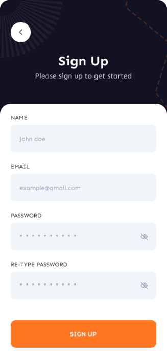 | 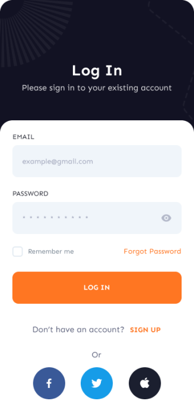 | 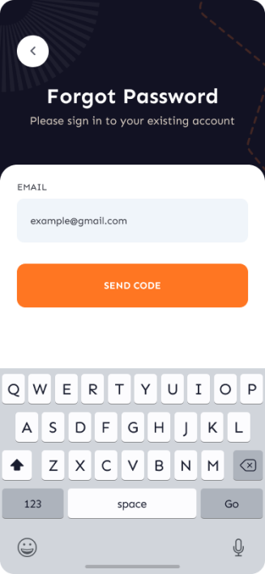 |

### Onboarding
| Free Delivery | Order from Chef | Favorites |
|---------------|-----------------|-----------|
| 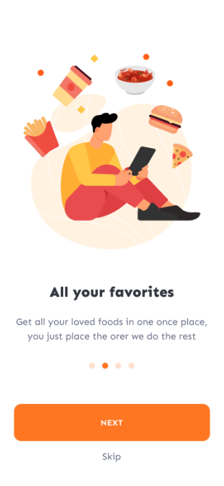 | 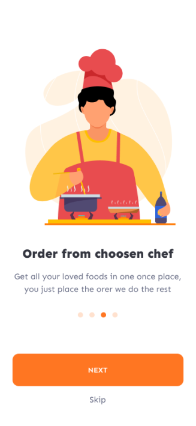 | 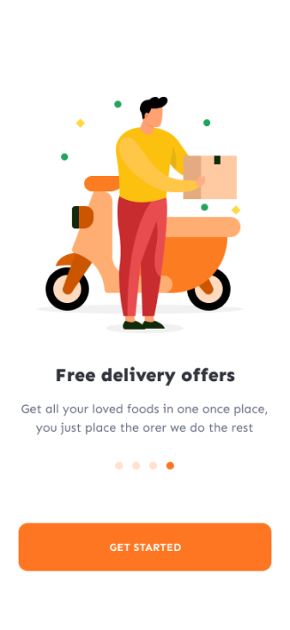 |

### Main Flow
| Home | Categories | Restaurant |
|------|------------|------------|
| 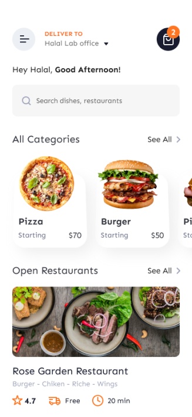 | 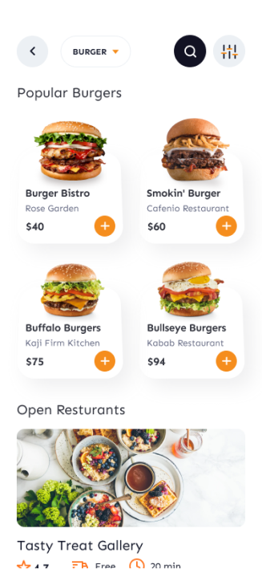 | 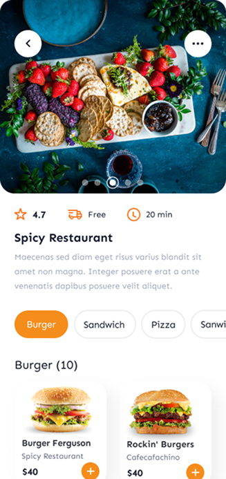 |

### Food & Cart
| Food Details | Cart | Payment |
|--------------|------|---------|
| 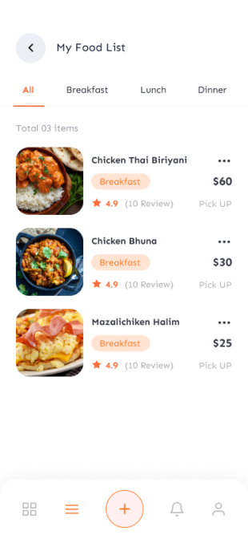 | 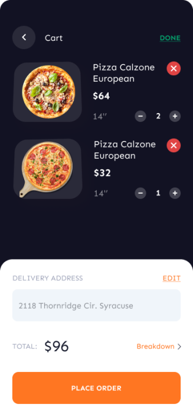 | 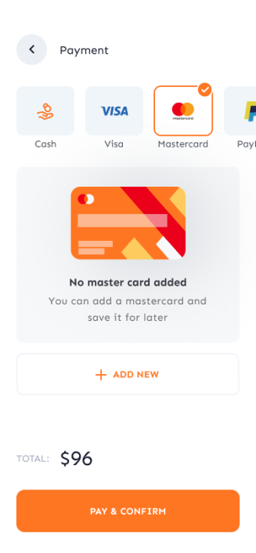 |

### Orders
| Track Order | Success | Profile |
|-------------|---------|---------|
| 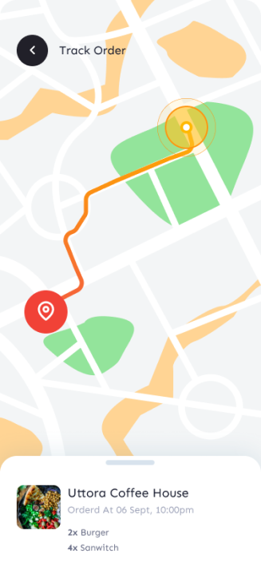 | 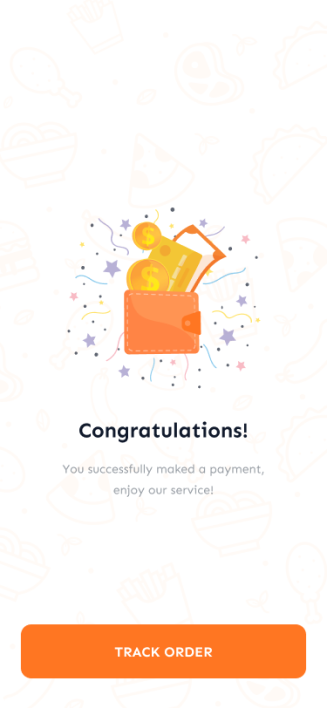 | 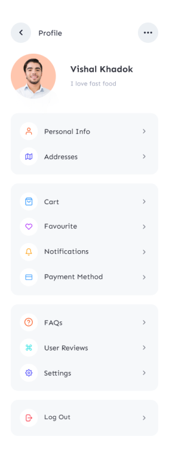 |

---

## 🎨 App Interfaces

The application includes **50+ screens**:

- 👤 **User Interfaces (40 screens)** → onboarding, authentication, home, search, restaurants, menus, cart, orders, profile  
- 👨‍🍳 **Chef Interfaces (10 screens)** → dashboard, add food, manage menu, track sales, notifications, reviews  


---

## ✨ Features

### 🔐 Authentication (Firebase)
- Email/Password login & registration  
- Google / Facebook Sign-In  
- Password reset via email  
- Secure session handling  

### 🍽️ Core Features (RESTful APIs)
- Restaurant discovery & categories  
- Food browsing & detailed menus  
- Add to cart & checkout process  
- Order tracking with live updates  
- Favorites & ratings  

### 💳 Payments
- Multiple payment options (Cash, Card, Wallets)  
- Card management  
- Payment confirmation  

### 👤 Profile
- Edit personal details  
- Manage delivery addresses  
- View past orders  
- Notification settings  

### 🔔 Notifications
- Push notifications with **Firebase Cloud Messaging (FCM)**  

---

## 🛠️ Tech Stack

- **Framework**: Flutter (Dart)  
- **Architecture**: MVVM  
- **State Management**: BLoC + Cubit  
- **Authentication**: Firebase Authentication  
- **Backend**: RESTful APIs  
- **Database**: Firebase Firestore / Realtime Database  
- **Notifications**: Firebase Cloud Messaging (FCM)  
- **Networking**: Dio HTTP Client  
- **Storage**: SharedPreferences  

---

## 📂 Project Structure

```
lib/
 ┣ core/              # Constants, helpers, themes, utils
 ┣ data/              # API services, repositories
 ┣ presentation/
 ┃ ┣ bloc/            # BLoC + Cubit classes
 ┃ ┣ view/            # Screens (UI layer)
 ┃ ┣ viewmodel/       # ViewModels (MVVM)
 ┃ ┗ widgets/         # Reusable widgets
 ┗ main.dart          # Entry point
```

---

## 🚀 Getting Started

### Prerequisites
- Flutter SDK `>=3.7`
- Android Studio / VSCode
- Firebase project configured
- Emulator or device

### Installation
```bash
git clone https://github.com/YOUR_USERNAME/food-delivery-app.git
cd food
flutter pub get
flutter run
```

### Firebase Setup
1. Create project at [Firebase Console](https://console.firebase.google.com)  
2. Add `google-services.json` (Android) & `GoogleService-Info.plist` (iOS)  
3. Enable authentication methods (Email/Google/Facebook)  
4. Enable Firestore & FCM  

---

## 🎨 Design System

### Colors
- Primary → Orange `#FF6B35`  
- Secondary → Dark Navy `#2D3748`  
- Background → Light Gray `#F8F9FA`  
- Success → Green `#48BB78`  
- Error → Red `#E53E3E`  

### Typography
- Google Fonts  
- Clear hierarchy (titles, subtitles, body text)  

### UX Principles
- Smooth animations  
- Responsive layouts (phones & tablets)  
- Accessible design patterns  

---

## 🔮 Future Enhancements
- Multi-language support (Arabic/English)  
- Chef Dashboard (advanced analytics)  
- Loyalty rewards system  
- Group ordering  
- AI-powered food recommendations  
- AR Menu preview  

---

## 👤 Author
- **Marco Mina Moris**  
  📧 [marcominamories@gmail.com](mailto:marcominamories@gmail.com)  
  🔗 [LinkedIn](https://www.linkedin.com/in/marco-mina-515369262)  
  💻 [GitHub](https://github.com/MARCO-Develper)  

---

**Built with Flutter 💙 | Powered by Firebase 🔥 | Driven by RESTful APIs ⚡**
